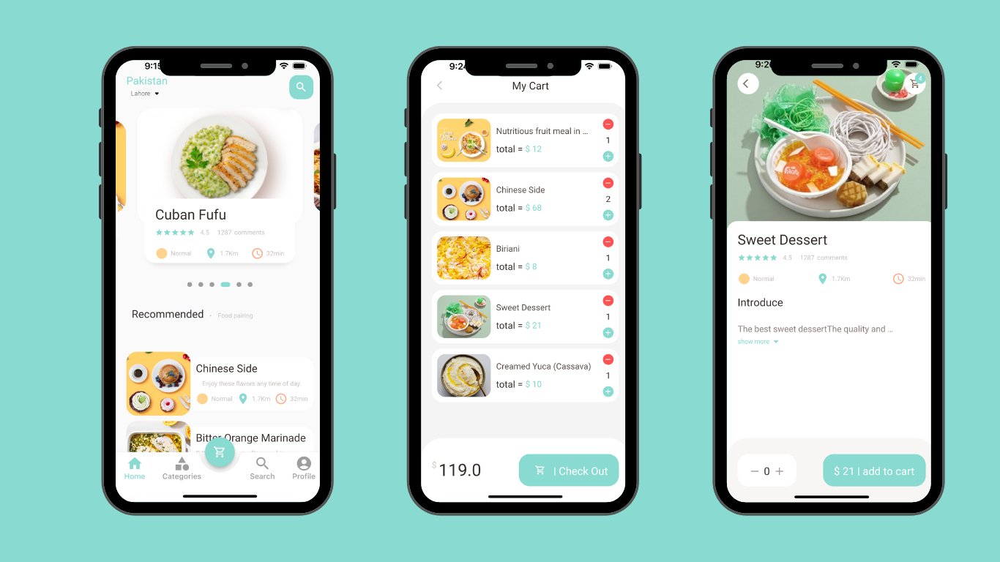

# Food Delivery Project

This is a food delivery application developed using Flutter framework. It allows users to browse different restaurants, select their favorite dishes, and order food for delivery to their location.

## Dependencies

This project uses the following packages:

- [getX](https://pub.dev/packages/get)

## Design

## Setup

To set up this project, follow these steps:

1. Clone the repository to your local machine using git clone (https://github.com/username/food-delivery.git)
2. Install dependencies by running `flutter pub get`
   <!-- 3. Create a new Firebase project and enable authentication, Cloud Firestore, and Cloud Functions -->
   <!-- 3. Add the Firebase configuration files to the project -->
   <!-- Enable the Google Maps API and add the API key to the project -->
   <!-- Enable the Stripe API and add the API key to the project -->
3. Run the application using `flutter run`

## License

This project is licensed under the GPL-3.0 license. See the LICENSE file for more information.
